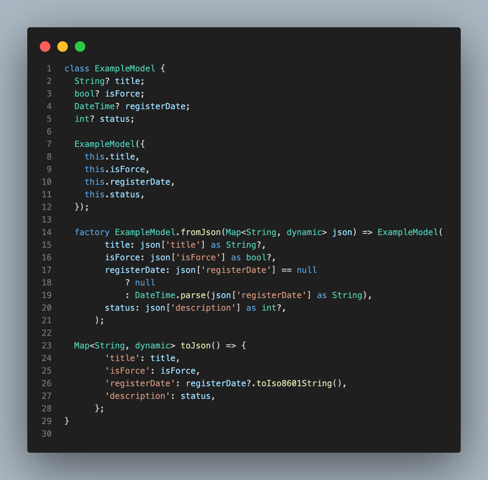
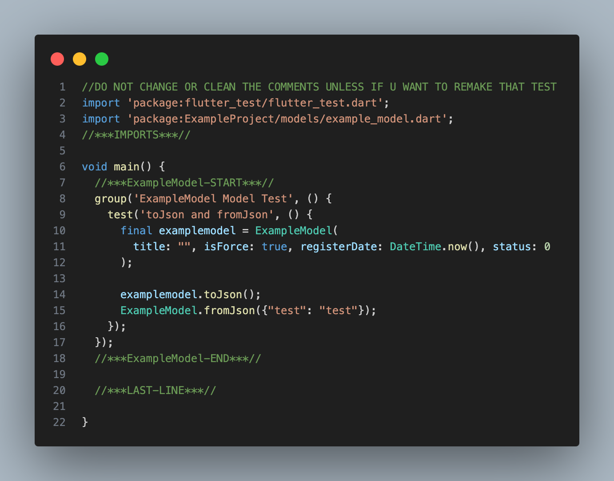

# 🧪 Flutter Test Generator

> ⚠️ **Note:** Only the **Model Test Generator** feature is available for now.  
> Support for other test types like **Bloc Test**, **Widget Test**, etc., will be added in the future.

The **Model Test Generator** feature of this extension helps you quickly scaffold unit tests for your Dart model classes in Flutter projects — saving time and improving consistency.


---

## 🚀 Features

✅ Adds a right-click menu option:  
**"Flutter Generate Model Test"** under the `Modification` section

✅ Automatically generates model test templates based on this structure:  


✅ Outputs test files like this:  


✅ Works on **single files** and **entire folders**

---

## 📂 How It Works

### ✅ Right Click on a Dart File
- Adds the option: `Flutter Generate Model Test`
- Generates a corresponding `*_test.dart` file with the required structure

### ✅ Right Click on a Folder
- Recursively scans for Dart files that contain `MODEL` in:
  - The **filename**, and
  - The **class name**
- Automatically generates model tests for each valid file

---

## 🧱 Generated Test Structure

Each generated test file includes:

```dart
//***IMPORTS***//

void main() {
  //***ExampleModel-START***//

  // test case...

  //***ExampleModel-END***//

  //***LAST-LINE***//
}
```

## 📝 Comment Tags

//***IMPORTS***//:
Used for auto-managing necessary imports during test generation or modification.

//***<ClassName>-START***// and //***<ClassName>-END***//:
Marks the beginning and end of each model's test block.
⚠️ Do not remove or edit these manually unless you want to completely regenerate that test.

//***LAST-LINE***//:
Acts as an anchor to append new model tests in the future if additional classes are found in the same file.

## ⚠️ Requirements
To enable model test generation:

The filename and class name must include the word "MODEL"
Example:

✅ user_model.dart with class UserModel

✅ productMODEL.dart with class ProductMODEL

❌ user.dart with class User

## 💡 Why Use This?
. Saves time writing repetitive test templates

. Enforces a consistent structure for unit tests

. Scalable — works with multiple files and folders

. Easy to modify and extend tests in future using the comment anchors

## 📌 Tip

If you want to regenerate a specific model test, delete the block between:

```dart
//***ClassName-START***//
//***ClassName-END***//
```
Then re-run the extension on that file or folder.

## 🙌 Contribution & Feedback
Found a bug or have a suggestion?
Feel free to open an issue or pull request on [GitHub](https://github.com/ParhamAB/flutter-tests-generator-extention).